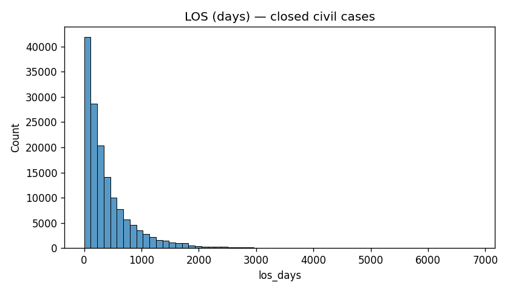
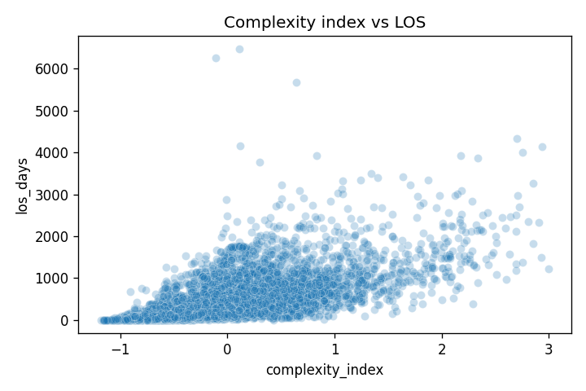
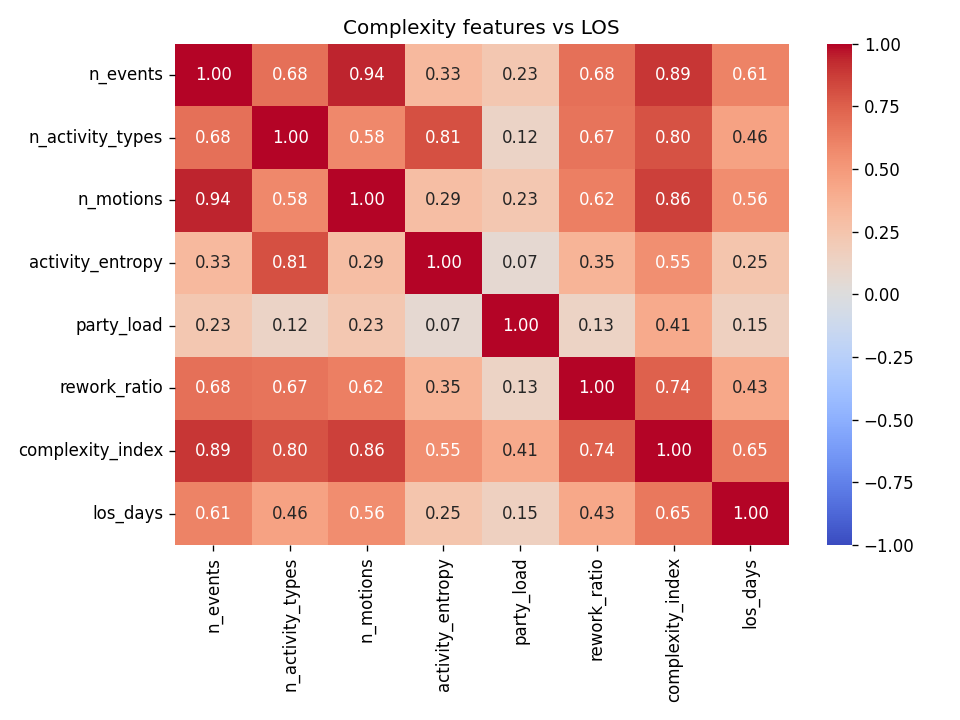
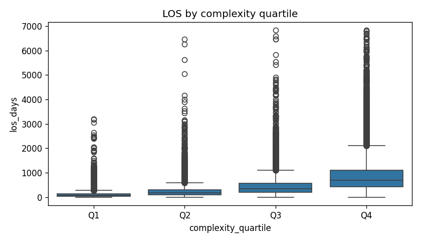
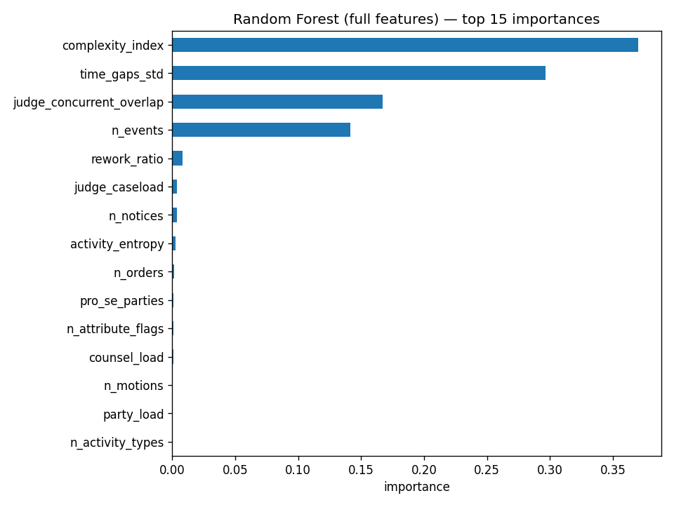
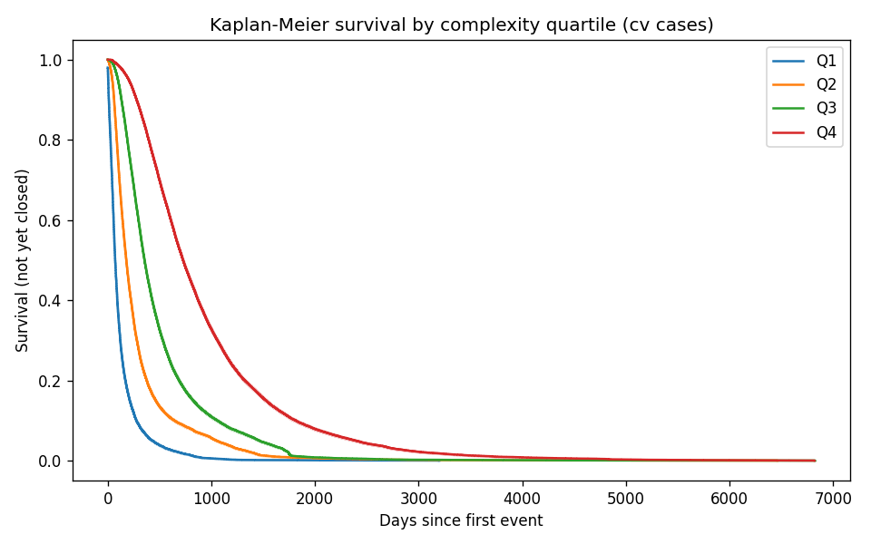
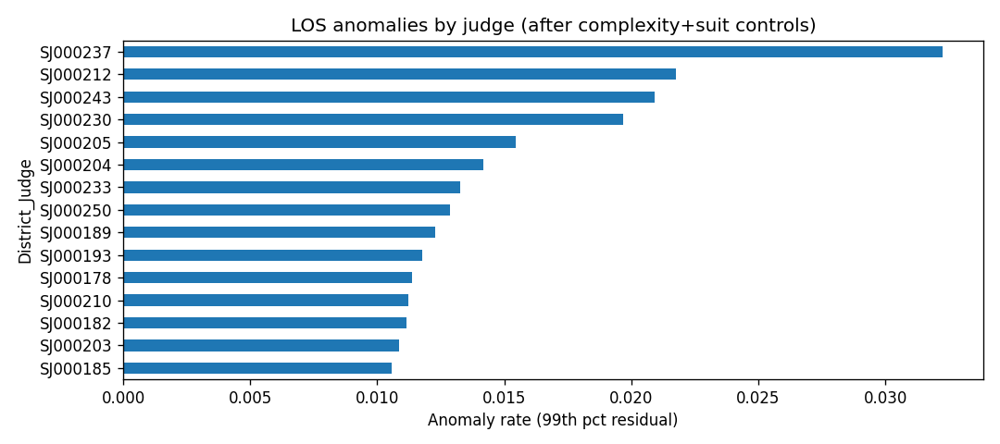
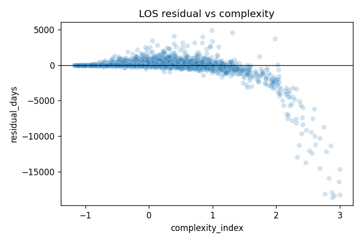

# Case Complexity and Operational Efficiency in Federal Civil Litigation

**University project** — Tel Aviv University  
**Advisor:** Dr. Shani Azaria  
**Data:** SCALES OKN Event Log, U.S. District Court for the Northern District of Illinois (1991–2021)

---

## 1. Introduction

Legal systems worldwide face heavy caseloads, long processing times, and operational bottlenecks. Process mining and operations management (OM) offer tools to study how cases flow through courts, but empirical work has been limited by scarce granular data.

This project uses a federal court **event log**: approximately **175,000 cases** and **4.8 million events** over 18 years. Each row records one procedural event (`Activity`) with timestamps and case metadata.

The core task is **modeling the relationship between families of metrics** — **complexity** (structural load of the case) and **efficiency** (time to completion) — and examining whether that relationship is **moderated by judge** and **court workload**.

### Research question

> **Is there a relationship between the complexity of a legal case and the operational efficiency of handling it, and does this relationship differ across judges?**

**Operational efficiency** is measured by **Length of Stay (LOS)**: calendar days from the first to the last docket event for **closed** civil cases.

**LOS as a survival outcome:** Time-to-event (case closure) is naturally a **survival** problem: each case “survives” in the system until its last event. During model development we compared **regression on LOS** (implemented) with **survival analysis** (Cox PH, Kaplan–Meier; see §3.6). Regression was used for the main results because the primary sample is **closed cases** with observed LOS; survival methods are the preferred extension for **open/censored** cases.

**Case complexity** is a multidimensional construct derived from the event log: procedural volume, activity diversity, motion intensity, party structure, and process variability.

---

## 2. Background and related work

*(Complete `docs/literature_notes.md` with 3–5 papers before submission.)*

**Process mining** models business and legal processes as event logs (case ID, activity, timestamp). It supports discovery of variants, bottlenecks, and conformance checking (van der Aalst, 2016).

**Operations management in courts** studies queueing, delay, and resource allocation. Empirical OM work links case characteristics to processing time and identifies judge-level heterogeneity.

**Gap:** Few studies combine large-scale event logs with explicit complexity metrics and judge-level moderation. The SCALES dataset enables this for a major federal district.

**References to add:**
- SCALES OKN documentation: https://docs.scales-okn.org/eventlog/
- Process mining textbook / survey (van der Aalst)
- Empirical court delay / judicial behavior papers (as required by course)

---

## 3. Data and methods

### 3.1 Data source

| Property | Value |
|----------|-------|
| Source | SCALES OKN Event Log |
| Venue | Northern District of Illinois (primarily Chicago) |
| Period | 1991-01-08 — 2021-07-11 |
| Events | 4,811,483 |
| Cases (unique `ucid`) | 175,268 |
| Analysis sample | **151,640** closed **civil (cv)** cases |

Criminal cases were excluded from the main analysis because nature-of-suit and procedural logic differ materially.

### 3.2 Unit of analysis

One row per case after aggregating all events by `ucid`.

### 3.3 Efficiency outcome

| Metric | Definition |
|--------|------------|
| **LOS (days)** | `max(date_filed) − min(date_filed)` per case |

Only `case_status == closed` cases receive a valid LOS.

For open cases, LOS is **right-censored** (duration observed only up to the last docket date). This motivates survival framing even when the main models use closed cases only.

### 3.4 Complexity features

| Feature | Definition |
|---------|------------|
| `n_events` | Total events |
| `n_motions` | Count of `Activity == motion` |
| `n_orders`, `n_notices` | Counts of orders and notices |
| `n_activity_types` | Unique activity types |
| `activity_entropy` | Shannon entropy over activity distribution |
| `n_attribute_flags` | Distinct `attribute_*` flags ever true |
| `rework_ratio` | Share of repeated activity types |
| `time_gaps_std` | Std of days between consecutive event dates |
| `party_load` | Plaintiffs + defendants count |
| `counsel_load`, `pro_se_parties` | Counsel and pro se exposure |
| **`complexity_index`** | Mean of z-scores of core complexity columns (after 1–99% winsorization; clipped to [−3, 3]) |

**Controls:** `nature_suit` (top 15 categories + Other), `District_Judge`, `related_case_count`.

**Judge workload:**
| Metric | Definition |
|--------|------------|
| `judge_caseload` | Static total cases per judge in dataset |
| `judge_concurrent_overlap` | Count of **other** cases with same judge whose date range overlaps this case |

### 3.5 Modeling pipeline (relationship between metric families)

1. **EDA** — distributions, correlations, complexity quartiles vs LOS  
2. **Regression (implemented)** — `log1p(LOS)` as function of complexity family + controls; judge fixed effects; complexity×judge interactions  
3. **Random Forest (implemented)** — nonlinear mapping from complexity (+ controls) to LOS  
4. **Process mining** — procedural variants and bottlenecks  
5. **Anomaly detection** — extreme LOS residuals after complexity and judge controls  

### 3.6 Survival analysis (**implemented**)

| Field | Definition |
|-------|------------|
| `survival_time_days` | Days from first to last event (all cv cases) |
| `event_observed` | 1 = closed, 0 = open (censored) |

| Method | Implementation |
|--------|----------------|
| **Kaplan–Meier** | `scripts/run_survival.py` — curves by complexity quartile |
| **Cox PH** | Hazard of closure vs complexity, concurrent load, party load |
| **OLS / RF** | Parallel models on closed cases with `log1p(los_days)` |

Sample: **157,703** cv cases; **151,640** closures; **6,063** censored (open).

**Software:** Python 3.13, pandas, scikit-learn, matplotlib, seaborn. Reproducible scripts in `scripts/`; notebooks in `notebooks/`.

**Train/test split:** 80/20 random split; judges with ≥200 cases in regression/ML subsample (n_train = 120,940; n_test = 30,236).

---

## 4. Results

### 4.1 Exploratory analysis



- **Median LOS:** 253 days (mean 425; right-skewed)
- **Correlation** complexity_index vs LOS: **r = 0.65**



**Median LOS by complexity quartile:**

| Quartile | Median LOS (days) |
|----------|-------------------|
| Q1 (lowest) | 69 |
| Q2 | 172 |
| Q3 | 346 |
| Q4 (highest) | 691 |

Higher complexity is associated with substantially longer case duration. The gradient is monotonic across quartiles.

  


### 4.2 Regression (main hypothesis)

Target: `log1p(los_days)`.

| Model | Description | R² (log scale) | MAE (days) |
|-------|-------------|----------------|------------|
| M1 | complexity + nature of suit | 0.515 | 305 |
| M2 | M1 + judge fixed effects | 0.536 | 298 |
| M3 | M2 + complexity × judge | **0.547** | **289** |

**Findings:**
1. **Complexity is positively associated with LOS** — confirmed in EDA (r = 0.65) and regression.  
2. **Judges add explanatory power** — R² improves from 0.515 to 0.536 when judge fixed effects are added.  
3. **Heterogeneity across judges** — the interaction model (M3) fits best, suggesting the complexity–LOS slope **varies by judge**. This supports the second part of the research question.

*Note: R² on the raw day scale is poor because of skew; log-scale R² is the appropriate fit metric.*

### 4.3 Machine learning

| Model | R² (log) | MAE (days) | Interpretation |
|-------|----------|------------|----------------|
| Regression M3 | 0.547 | 289 | Linear benchmark |
| RF restricted | 0.797 | 149 | Excludes `n_events`, `time_gaps_std` |
| RF full | 0.945 | 76 | Includes volume/timing (partly mechanical) |



**Restricted RF** (fairer): top drivers are `complexity_index`, `rework_ratio`, `activity_entropy`, `party_load`. Judge + suit importance combined ≈ **4.5%**.

**Caveat:** `n_events` and `time_gaps_std` in the full RF almost determine LOS by construction (longer cases accumulate more events). Report conclusions should rely on **restricted RF** and **regression**, not the full RF R².

### 4.4 Process mining

Sample: 5,000 civil cases; **4,430 unique variants** → high procedural heterogeneity.

**Frequent short path:** `complaint → motion → order`  
**Dominant transitions:** `minute_entry → minute_entry`, `motion → notice`, `notice → minute_entry`

**Bottleneck (motion → next order):**
- Median delay: **50 days**
- 90th percentile: **306 days**

Delays between motions and judicial orders are a plausible operational bottleneck.

### 4.5 Survival analysis



| Metric | Value |
|--------|-------|
| Cases | 157,703 |
| Closed (event=1) | 151,640 |
| Open / censored | 6,063 |
| Log-rank (complexity quartiles) | p ≈ 0 |

**Median time-to-closure by complexity quartile (KM):** Q1 71d, Q2 179d, Q3 355d, Q4 726d — aligns with LOS regression.

**Cox PH** (concordance **0.83**):

| Covariate | Hazard ratio | Interpretation |
|-----------|--------------|----------------|
| complexity_index | 0.12 | Higher complexity → **lower** hazard of closure → longer time in system |
| judge_concurrent_overlap | ≈1.00 | Small per-case marginal effect; see RF importance |
### 4.6 Judge workload in ML

**Restricted Random Forest** (fair feature set):

- `judge_concurrent_overlap` importance: **~30%** (second after complexity_index)
- Confirms: **case-level metrics alone are insufficient** — cumulative judge load matters

| Model | R² (log) | MAE (days) |
|-------|----------|------------|
| RF restricted (incl. workload) | **0.856** | **99** |
| Regression M3 | 0.544 | 290 |

### 4.7 Anomalies

1,512 cases (top **1%** of LOS residuals after controlling complexity, suit type, and judge).

- Median excess duration vs prediction: **~1,186 days**
- Some anomalies have **low** complexity but extreme LOS → **stalled** cases, not merely “complex” ones
- Elevated anomaly rates for specific judges (e.g. SJ000237 ≈ 3.2% vs ~1% baseline)

  


---

## 5. Discussion

### 5.1 Answering the research question

| Question | Answer |
|----------|--------|
| Complexity ↔ efficiency? | **Yes.** Strong positive association (r ≈ 0.65; higher complexity quartiles → much longer LOS). |
| Varies by judge? | **Yes, partially.** Judge fixed effects and interactions improve predictive fit; anomaly rates differ across judges. |

### 5.2 Practical implications

- Courts may use complexity scores to forecast expected duration and allocate resources.  
- Targeting **motion→order** delays could improve throughput.  
- Anomaly monitoring could flag stalled cases early, including low-complexity long runners.

### 5.3 Limitations

1. **Single district** — results may not generalize beyond ND Illinois.  
2. **Observational** — no causal claim; judge assignment is not randomized.  
3. **LOS definition** — last docket event ≠ final substantive resolution for all case types.  
4. **Censoring** — 6,063 open cases; survival models address this; regression still uses closed only.  
5. **Concurrent load proxy** — overlap count is approximate; not event-level queue simulation.  
6. **Mechanical features** — `n_events` / `time_gaps_std` inflate full RF; use restricted RF.  
7. **Judge IDs** — anonymized codes.  
8. **Process mining sample** — 5,000 cases.

### 5.4 Future work

- Monthly rolling judge queue pressure.  
- Causal designs for judge assignment.

---

## 6. Conclusion

Using a large federal court event log, this project shows that **case complexity is strongly associated with longer case duration (LOS)** in civil litigation. **Judges differ** in how cases progress: judge effects and complexity×judge interactions improve models, and residual anomalies cluster on some judges. Process mining highlights **motion-to-order delay** as a recurring bottleneck.

The work contributes an empirical, data-driven view of court operations aligned with process mining and OM — and demonstrates how event logs can support both **prediction** and **diagnostic** analysis of judicial efficiency.

---

## 7. Reproducibility

```bash
cd Project
source .venv/bin/activate
pip install -r requirements.txt

python scripts/profile_event_log.py
python src/build_features.py --case-type cv
python src/add_judge_workload.py
python scripts/run_survival.py
python scripts/run_eda.py
python scripts/run_regression.py
python scripts/run_ml.py
python scripts/run_process_mining.py --sample-cases 5000
```

Or: `bash scripts/run_extended_pipeline.sh`

**Outputs:** `data/case_features.parquet`, `reports/figures/01–09`, `docs/step*.json`

---

## Appendix: Figure index

| Figure | File | Content |
|--------|------|---------|
| 1 | `01_los_histogram.png` | LOS distribution |
| 2 | `02_complexity_vs_los.png` | Scatter complexity vs LOS |
| 3 | `03_correlation_heatmap.png` | Feature correlations |
| 4 | `04_los_by_complexity_quartile.png` | Boxplot by quartile |
| 5 | `05_regression_residuals.png` | *(optional, from notebook 02)* |
| 6 | `06_rf_feature_importance.png` | Random Forest importance |
| 7 | `07_anomaly_rate_by_judge.png` | Anomaly rates |
| 8 | `08_residual_vs_complexity.png` | LOS residuals |
| 9 | `09_km_by_complexity.png` | Kaplan-Meier by complexity quartile |

---

*Draft generated from project pipeline — 2026-05-19. Expand Section 2 with your literature review before submission.*
